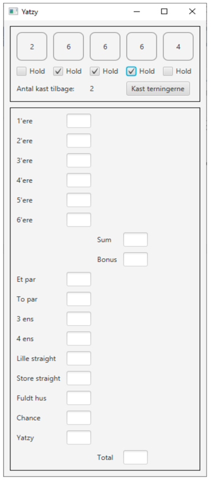
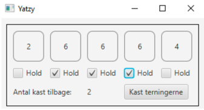
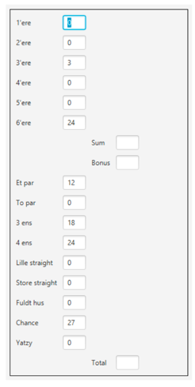

#### Lavet af Hans-Henrik, Rasmus og Asger

## Projektbeskrivelse

### Projektmål

I dette projekt skal der laves en desktop applikation. Brugergrænsefladen skal laves ved brug
af JavaFx. Med appen skal man kunne spille Yatzy med 5 terninger for en spiller.

### Baggrund

Yatzy går ud på at ramme specifikke kombinationer med fem terninger. Spillet spilles ved, at
man kaster sine terninger i runder. Efter hver runde skriver man point ud fra en valgfri ledig
kombination på pladen (det er muligt at score 0).
Spillet er opdelt i 13 kombinationer, som er yderligere opdelt i to sektioner: Den øvre og den
nedre.

### Regler for Yatzy med 5 terninger er givet ved:

* I hver runde har spilleren 3 slag. Ved hvert terningslag må spilleren vælge de ternin-
  ger fra, som han vil samle på. De resterende terninger bruges i næste slag.

* Når spilleren har haft sine 3 kast, noteres hans/hendes point ud fra en valgfri kombi-
  nation, og turen fortsætter til næste spiller.

* På øverste del af pointblokken er målet at få så mange som muligt af hver (1´ere,
  2´ere osv.) for at opnå sin bonus. For at få sin bonus, skal man have minimum 63
  point (dvs. i gennemsnit 3 af 1´erne, 3 af 2´erne osv.). Bonus giver 50 point, som
  skrives i feltet under summen.

* På nederste del af pointblokken opnås point således:
    * 1 par (2 ens højst 12)
    * 2 par (2 x 2 ens højst 22)
    * 3 ens (3 ens højst 18)
    * 4 ens (4 ens højst 24)
    * ”Lille Straight” (1, 2, 3, 4, 5 giver 15)
    * ”Stor Straight” (2, 3, 4, 5, 6 giver 20)
    * ”Fuldt Hus” (3+2 ens højst 28)
    * Chance (alle øjne lægges sammen, højst 30)
    * Yatzy (5 ens giver 50 point)
    * Alle point lægges sammen efter hver runde, og spilleren kan se sin totale score.

### Brugergrænsefladen

I må designe jeres brugergrænseflade
som I ønsker. Et eksempel på hvordan
den kan udformes er dette.

Når spilleren klikker på knappen Kast terningerne, vises øjnene for kastet øverst i vinduet.
Spilleren angiver ved at markere i en checkbox, hvilke terninger der skal gemmes. Ovenfor
kan ses at spilleren har valgt at gemme de tre terninger der viser seks.

Når spilleren har kastet terningerne tre gange, vises de
potentielle point som kan scores for de forskellige
kombinationer.

#### Eksempel over.

Spilleren skal nu vælge hvilken kombination vedkom-
mende ønsker at score, hvorefter en ny runde starter.
Dette fortsætter indtil spilleren har valgt alle kombinati-
oner.

Det skal kun være muligt at vælge en kombination en
gang.

